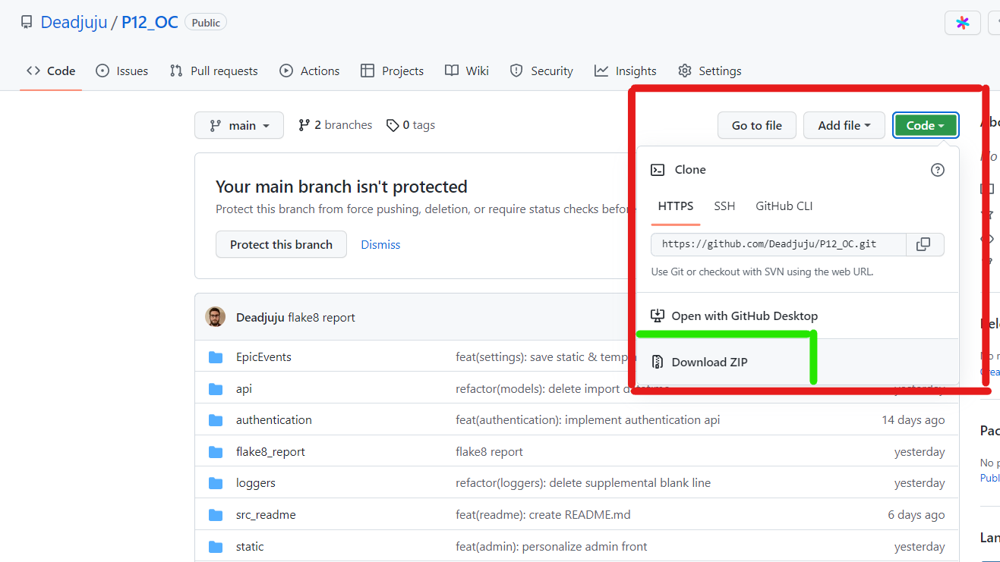
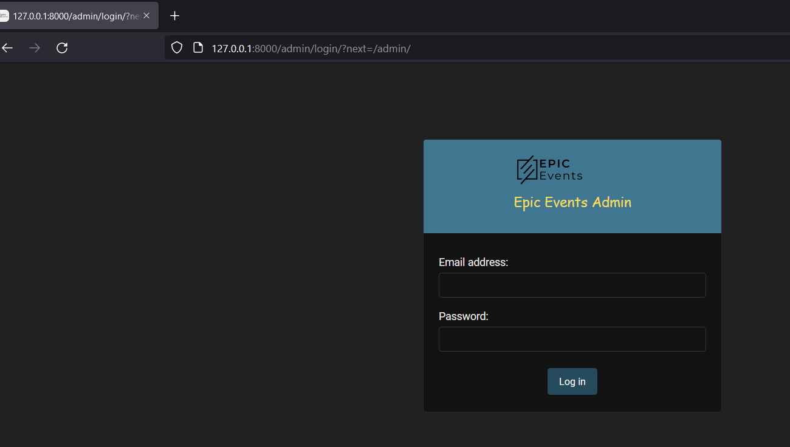

  
  

# PROJET 12 - Développez une architecture back-end sécurisée en utilisant Django ORM
  
  
***
***    

## Sommaire

* [I. Présentation du projet](#chapter1)
    * [L'application](#section1_1)
    * [Vocabulaire de l'application](#section1_2)
* [II. Installation du projet](#chapter2)
    * [Langage et *packages* utilisés](#section2_1)
    * [Récupération du programme](#section2_2)
    * [Environnement virtuel](#section2_3)
    * [Installer les paquets](#section2_4)
* [III. La base de donnée](#chapter3)
* [IV. Démarrer avec l'application](#chapter4)
    * [Les migrations](#section4_1)
    * [SuperUtilisateurs](#section4_2)
    * [Se connecter à l'interface administration](#section4_3)
* [V. Documentation de l'API](#chapter5)
* [VI. Rapport Flake8](#chapter6)

    
## I. Présentation du projet <a class="anchor" id="chapter1"></a>

### L'application <a class="anchor" id="section1_1"></a>


Ce projet présente le code de la partie back-end d'un logiciel **CRM**  (Customer Relationship Management) ou encore **Outil de Gestion des Clients** développé pour l'entreprise d'évènementielle "***fictive***" **EpicEvents**.  
L'application est une **API** qui peut-être compatible à la fois avec les applications **Web**, **IOS** ou **Android**.  
Le **CRM** permettra la création de nouveaux clients ainsi que le suivi d'évènements (passés ou futures) organisés pour des clients. Il permettra également de lier les contrats aux évènements et aux clients.  
L'**API** sera une application sécurisée garantissant la sécurité des données des clients et limitera l'accès uniquement aux utilisateurs concernés par chaque *clients* / *évènements*.

### Vocabulaire de l'application <a class="anchor" id="section1_2"></a>

- **User** - représente les utilisateurs de l'application.  
Il s'agit ici des employés de **EpicEvents**.
L'entreprise possède trois types d'employés:

  - **MANAGEMENT (L'équipe de gestion)**: Ils possèdent le status de ***superutilisateur*** et utilisent l'interface **Admin** de Django. 
  >Voir la [section concernant l'interface administration](#section4_3) pour  plus d'informations.
  - **COMMERCIAL (L'équipe de vente)**: Ils peuvent créer des clients et modifier leurs clients. Le CRM leur permettra également de renseigner des contrats et des évènements pour leurs clients et les modifier.
  - **SUPPORT (L'équipe de support)**: Ils s'occupent de l'organisation des évènements qui leurs sont attribués par l'équipe de **gestion**. Le CRM leur permet de modifier leurs évènements ainsi que d'avoir accès aux informations des clients et des contrats concernés par leurs évènements.

- **Client** - représente les clients de **EpicEvent**.
- **Contract** - Un contrat est créé avant chaque événement
- **Event** - Un événement rattaché à un contrat

>- Tout les utilisateurs ont accés aux listes des **clients**, **contrats** et **évènements** en ***lecture seule***.    

>*ℹ️ Pour plus d'informations sur les permissions de chaque utilisateurs voir <a href="https://documenter.getpostman.com/view/18466277/VUquMFr7" target="_blank">la documentation de l'API</a>.*

***  

## II. Installation du projet <a class="anchor" id="chapter2"></a>

**-> Temps estimé: 5 minutes.**  

### Langage et *packages* utilisés <a class="anchor" id="section2_1"></a>
Ce programme a été écrit sur les versions
- **Python 3.10.1**
- **Django 4.1**
- **DjangoREST 3.13.1**
  
### Récupération du programme <a class="anchor" id="section2_2"></a>

Ouvrez un terminal dans le dossier de destination et entrez la commande suivante pour télécharger le repository:   
 
    git clone https://github.com/Deadjuju/P1_OC.git

Il est également possible de télécharger le fichier zip contenant l'intégralité du code du programme: 

  
   
Rendez-vous ensuite avec le terminal au niveau de la racine du projet en exécutant la commande suivante:

    cd P12_OC

### Environnement virtuel (avec venv)<a class="anchor" id="section2_3"></a>
  
Dans la racine du dossier :  
     
  1. Taper la commande suivante pour générer l'environnement virtuel:  

    python -m venv .env  


> *.env* est le nom par défaut de l'environnement virtuel mais peut être nommé différemment.  
  
  2. Activer ensuite l'environnement virtuel :
    
    > Sur Windows  
    - terminal de type bash : source .env/Scripts/activate
    - terminal de type shell : .env\Scripts\activate
      
    > Sur Mac ou Linux
    - source .env/bin/activate

### Installer les paquets <a class="anchor" id="section2_4"></a>
  3. Pour installer les librairies supplémentaires exécuter la commande suivante :
  > *ℹ️ - Vérifier bien que l'environnement virtuel soit activé*

    pip install -r requirements.txt

## III. La base de données <a class="anchor" id="chapter3"></a>

L'application a été pensé et configuré pour une base de données **PostgreSQL**, mais peut être utilisé avec d'autre base de données SQL. 

> ℹ️ -  Si vous n'utilisez **pas** PostgreSQL, pensez à changez les settings de django.

> ℹ️ -  Vérifiez que PostgreSQL soit installé sur votre machine.  
Pour l'installation: [Download PostgreSQL](https://www.postgresql.org/download/)  

Créez un fichier **psql_configuration.py** à la racine du projet.  

Collez ce qui suit dans le fichier **psql_configuration.py**:

```python
# Configuration to connect app to PostgreSQL

NAME: str = 'epicevents_db'  
USER: str = 'epicevents_user'  
PASSWORD: str = 'epicevents_password'  
HOST: str = '127.0.0.1'  
PORT: str = '5432'  
```

Connecter vous au shell **PSQL** pour créer la base de données et l'utilisateur:  

    > Sur Windows:  
      - Ouvrez l'application psql (PostgreSQL Shell)

    > Sur Mac ou Linux
      - Ouvrez un terminal et tapez la commande  
      psql
      pour ouvrir le shell


Une fois connecté a **PSQL**  (en tant qu'ADMIN): 

- **epicevents_db**: Nom de la base de donnée (donnez le nom que vous voulez)  
Pour créer une nouvelle base de données tapez la commande suivante:  

    ```sql
    CREATE DATABASE epicevents_db;  
    ```
- **epicevents_user**: Nom de l'utilisateur de la bdd (donnez le nom que vous voulez)  
**epicevents_password**: mot de passe de l'utilisateur  (donnez le nom que vous voulez)  
Tapez la commande:

    ```sql
    CREATE USER epicevents_user WITH ENCRYPTED PASSWORD 'epicevents_password';
    ```

- Tapez ensuite les 3 commandes suivantes afin d'accorder les privilèges à l'utilisateur:  

```sql
ALTER ROLE epicevents_user SET client_encoding TO 'utf8';

ALTER ROLE epicevents_user SET default_transaction_isolation TO 'read committed';

GRANT ALL PRIVILEGES ON DATABASE epicevents_db TO epicevents_user;
```

***
***

### **L'application est maintenant prête à être utilisée!!!**

***
***
  
## IV. Démarrez avec l'application <a class="anchor" id="chapter4"></a>  
  
### Les migrations <a class="anchor" id="section4_1"></a>

Ouvrez un terminal à la racine du projet et effectuez les premières migrations:

> *ℹ️ - Vérifier bien que l'environnement virtuel soit activé*

```
python manage.py makemigrations

python manage.py migrate
```
  
### SuperUtilisateurs <a class="anchor" id="section4_2"></a>

Pour créer un superutilisateur, dans le terminal :

```
python manage.py createsuperuser
```
Et renseignez chaque champs (exemple) :

  

### Se connecter à l'interface administration <a class="anchor" id="section4_3"></a>

Lancez le serveur avec la commande 

```
python manage.py runserver
```

et rendez vous sur votre navigateur à :
http://127.0.0.1:8000/admin/

> Vous pouvez choisir le port en entrant la commande  
python manage.py runserver <numéro-du-port>  
http://127.0.0.1:<numéro-du-port>/admin/  
ex:  
python manage.py runserver 8080  
http://127.0.0.1:8080/admin/  
  
Enfin, pour arrêter le serveur utilisez les touches *ctrl* + *c* dans le terminal. 

  

## V. Documentation de l'API <a class="anchor" id="chapter5"></a>

Une documentation détaillée de l'API est disponible à l'adresse suivante :  
><a href="https://documenter.getpostman.com/view/18466277/VUquMFr7" target="_blank">https://documenter.getpostman.com/view/18466277/VUquMFr7</a>

Vous trouverez dans cette documentation tout les points de terminaisons de l'API détaillés et documentés ainsi que des informations essentielles supplémentaires.

***

## VI. Rapport Flake8 <a class="anchor" id="chapter6"></a>  

**Flake8** permet d'éplucher le code écrit et de repérer les erreurs de syntaxes et les non conformités avec la **PEP**.
Un rapport html contenant les éventuelles erreurs peut-être généré.

Il se trouve à la racine du dossier dans le dossier : **flake8_rapport**

> - flake8_rapport
>   - index.html

Un nouveau rapport peut-être généré en exécutant la commande suivante dans le terminal :

    flake8 --format=html --htmldir=flake8_report

***  
